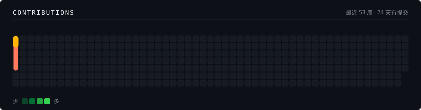
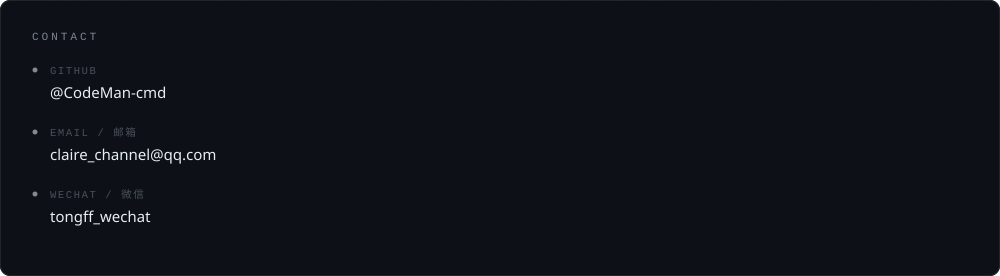

<!--
  ═══════════════════════════════════════════════════════════════════════════
  Claire · GitHub 个人主页　GitHub Profile

  设计取向：极简 + 中英对照。全页只回答四个问题 ——
  我是谁、我在做什么、做出过什么、怎么找我。
  Minimal and bilingual. Four questions only: who / what / shipped / how to reach.

  ── 底线（改之前先读）──
    · 数字都要能查到出处，GitHub 数据来自 API 实测且可点链接复查；
    · 「已合并」与「待审核」严格分开，绝不合并成"贡献 N 个 PR"；
    · 未开源的项目写明「未开源」，不装成能点开验证；
    · 不写雇主与客户名 —— 那是客户的披露权，不是我的；
    · 不写"精通 / 资深 / 专家"这类无法验证的自我评价。

  ── 实现约束 ──
    · 卡片是本仓库自带的静态 SVG（assets/），不用第三方卡片服务：
      实测本机 *.vercel.app 的 DNS 被污染（github-readme-stats 等四个热门服务全不可达），
      写进 README 就是坏图。自渲染零依赖、不受速率限制。
    · 每张卡有深/浅两套，用 <picture> + prefers-color-scheme 自适应。
    · 贪吃蛇用 CSS @keyframes（与 Platane/snk 同路线）。**不能用 SMIL**：
      GitHub 渲染仓库 SVG 走  语义，实测 SMIL 版在该场景下完全不动。
      验证页：preview/css-snake-verify.html（用 <object> 载入，等同  语义）
    · 蛇是**静态快照**，不会自动更新；提交后要重跑下面两条命令才会长出新的格子。

  ── 维护命令 ──
    刷新贡献数据 + 重画贪吃蛇   node tools/fetch-contributions.mjs && node tools/generate-snake.mjs
    重新渲染联系卡             node tools/generate-assets.mjs
    上线前体检                 node tools/verify-assets.mjs
    本地看效果                 node tools/preview-server.mjs   → http://127.0.0.1:8123/
  ═══════════════════════════════════════════════════════════════════════════
-->

<h3 align="center">Claire</h3>

  AI 应用开发 · 多 Agent 编排 · RAG 
  AI Application Development · Multi-Agent Orchestration · RAG

  6 年企业级开发经验（医疗 / 政务 / 制造） 
  6 years of enterprise development（Healthcare / GovTech / Manufacturing）

 

### Hopeflow · AI 短剧创作平台（AI Short-Drama Platform）

全栈独立开发 · <b>未开源</b>（可面谈演示）　Solo full-stack · <b>Not open source</b>（demo available）

覆盖「小说 → 剧本 → 分镜 → 素材 → 视频」一站式创作链路。 
An end-to-end pipeline: novel → script → storyboard → assets → video.

 

<!-- 刻意不用「HTML 表格内嵌 Markdown」做双栏布局：
     找了 10 个知名仓库（github/docs、public-apis、coding-interview-university 等），
     没有任何一个用这种写法，无法验证 GitHub 是否解析 <td> 内的 Markdown。
     改用纯 Markdown 的「粗体标题 +  英文」——这种写法在本项目的预览器与
     GitHub 上都确定可靠。不确定性不该出现在主页上。 -->

**三层 Agent 协作**
决策层 → 执行层 → 监督层编排，全自动与人工决策双模式

Three-layer agent orchestration — decision → execution → supervision, with fully-automatic and human-in-the-loop modes

**本地向量 RAG**
ONNX 本地模型实现跨会话记忆与知识库检索，推理全链路本地化

Local vector RAG — ONNX-based cross-session memory and knowledge retrieval, fully local inference

 

## Contributions

  <picture>
    <source media="(prefers-color-scheme: light)" srcset="./assets/snake-light.svg">
    
  </picture>

 

  <picture>
    <source media="(prefers-color-scheme: light)" srcset="./assets/contact-light.svg">
    
  </picture>

 

<!-- 卡片是图片、文字点不动，所以这里给一行真正可点的入口 -->

  
    <a href="mailto:claire_channel@qq.com">claire_channel@qq.com</a>
    &nbsp;&nbsp;·&nbsp;&nbsp;
    <a href="/CodeMan-cmd">github.com/CodeMan-cmd</a>
    &nbsp;&nbsp;·&nbsp;&nbsp;
    微信 WeChat tongff_wechat
  

