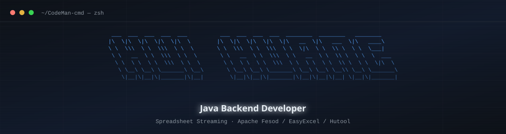
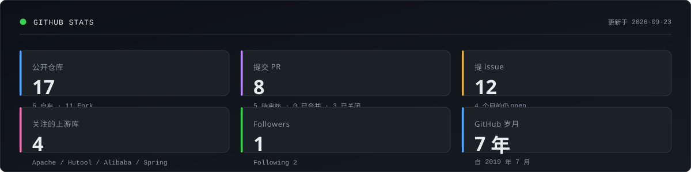
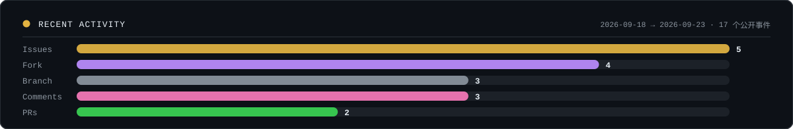
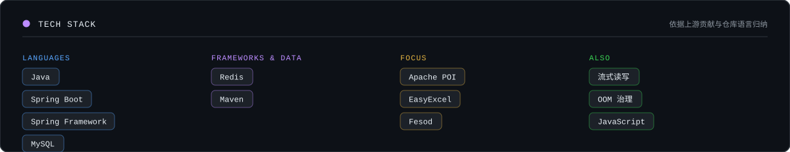

<!--
  ═══════════════════════════════════════════════════════════════════════════
  CodeMan-cmd 个人主页 README
  ───────────────────────────────────────────────────────────────────────────
  本页所有图片资源均经过"可达性验证"后再写入：
    · 头图与统计卡是**本仓库自带的静态 SVG**（assets/），零第三方依赖、
      不受速率限制、也不受网络环境影响，永远不会渲染成坏图；
    · 徽章来自 shields.io，图标来自 skillicons.dev —— 均经本机实测可达。
    · 本页**不使用** github-readme-stats / github-profile-trophy /
      capsule-render / activity-graph：这四个服务托管在 *.vercel.app，
      实测在本机网络下 DNS 被污染（github-profile-trophy.vercel.app 解析到
      80.87.199.46，capsule-render.vercel.app 解析到 31.13.80.169 等无关 IP），
      写进 README 就是坏图。
    · README 里每一个 URL 都跑过 `node tools/verify-assets.mjs` 才落笔；
      本地预览：`node tools/preview-server.mjs` 后打开 http://127.0.0.1:8123/
  重新生成统计卡：node tools/generate-assets.mjs
  ═══════════════════════════════════════════════════════════════════════════
-->

<!-- 头图：深色 / 浅色两套静态 SVG 自适应。
     用 <picture> + prefers-color-scheme 按访客主题切换，是 GitHub 上验证过的做法。
     注意：<source> 要放在  之前， 作为兜底。 -->
<div align="center">
  <picture>
    <source media="(prefers-color-scheme: light)" srcset="./assets/banner-light.svg">
    
  </picture>
</div>

<div align="center">
  <a href="https://github.com/CodeMan-cmd"></a>
  <a href="mailto:2291415248@qq.com"></a>
  
</div>

---

```java
/**
 * 专注把"大文件读进内存就 OOM"这类问题，变成一行行可靠的流式代码。
 */
public final class CodeMan {

    private final String  name     = "Rosemonder";
    private final String  role     = "Java Backend Developer";
    private final String  location = "China";

    /** 主战场：Java 后端 + 电子表格流式处理 */
    private final String[] core    = { "Java", "Spring Boot", "MySQL", "Redis", "Maven" };
    private final String[] focus   = { "Apache POI", "EasyExcel", "Fesod", "流式读写", "OOM 治理" };

    /** 正在读源码、提修复的上游项目（PR 尚在审核中） */
    private final String[] reading = { "apache/fesod", "chinabugotech/hutool", "alibaba/easyexcel" };

    public String motto() {
        return "读源码，找根因，提 PR。";
    }
}
```

<div align="center">
  <picture>
    <source media="(prefers-color-scheme: light)" srcset="./assets/stats-light.svg">
    
  </picture>
</div>

<div align="center">
  <picture>
    <source media="(prefers-color-scheme: light)" srcset="./assets/activity-light.svg">
    
  </picture>
</div>

---

## 🧰 技术栈

<div align="center">
  <!-- skillicons 支持 theme 参数，这里同样按访客主题切换，避免浅色主题下出现深色图标块 -->
  <picture>
    <source media="(prefers-color-scheme: light)" srcset="https://skillicons.dev/icons?i=java,spring,mysql,redis,maven,git,idea,js,html,css&theme=light">
    
  </picture>
</div>

<div align="center">
  <picture>
    <source media="(prefers-color-scheme: light)" srcset="./assets/stack-light.svg">
    
  </picture>
</div>

---

## 🔭 最近在折腾什么

近期在读 **Apache Fesod**（高性能电子表格读写库）和 **Hutool** 的源码：定位根因 → 提 issue → 提修复。

> **状态说明**：下面这些 PR 目前**全部处于待审核（open）状态，尚无一个被合并**。写在这里只是说明我正在做什么，不代表已被上游接纳。

### 提了修复（待审核）

| 项目 | 内容 | 状态 |
| :--- | :--- | :--- |
| [**apache/fesod**](https://github.com/apache/fesod) | [#1133](https://github.com/apache/fesod/pull/1133) 补充 `java.sql.Date` / `java.sql.Time` / `java.time.Instant` / `java.time.YearMonth` 的转换器 | 🟡 待审核 |
| | [#1132](https://github.com/apache/fesod/pull/1132) 克隆 `ReadCellData` 时保留行列坐标 | 🟡 待审核 |
| | [#1130](https://github.com/apache/fesod/pull/1130) 驼峰字段名（如 `xRealIp`）下的列 include/exclude 错选 | 🟡 待审核 |
| [**chinabugotech/hutool**](https://github.com/chinabugotech/hutool) | [#4330](https://github.com/chinabugotech/hutool/pull/4330) `FileMagicNumber` 对截断输入抛 `ArrayIndexOutOfBoundsException` | 🟡 待审核 |
| | [#4327](https://github.com/chinabugotech/hutool/pull/4327) `Caesar.encode()` 负偏移量抛异常、非字母表字符被静默损坏 | 🟡 待审核 |

### 报的缺陷

| 项目 | 内容 | 状态 |
| :--- | :--- | :--- |
| [**chinabugotech/hutool**](https://github.com/chinabugotech/hutool) | [#4328](https://github.com/chinabugotech/hutool/issues/4328) `FileMagicNumber` 的 MP3 / DOC matcher 截断输入越界 | 🐞 open |
| | [#4326](https://github.com/chinabugotech/hutool/issues/4326) `Caesar.encode()` 负偏移量抛 `StringIndexOutOfBoundsException` | 🐞 open |
| [**apache/fesod**](https://github.com/apache/fesod) | [#1131](https://github.com/apache/fesod/issues/1131) 读入 `ReadCellData` 丢失行列索引 | 🐞 open |
| | [#1129](https://github.com/apache/fesod/issues/1129) 列筛选对 `xRealIp` 这类字段名判断错误 | 🐞 open |

> 我在意的是**边界情况下的正确性**：负偏移量、截断输入、驼峰与下划线的字段映射、坐标信息的隐式丢失——这类问题往往要等生产数据才炸出来。

---

## 📌 项目导航

<div align="center">
  <a href="https://github.com/CodeMan-cmd/hot-spot"></a>
  <a href="https://github.com/CodeMan-cmd/CodeMan-cmd"></a>
</div>

| 仓库 | 说明 | 语言 |
| :--- | :--- | :--- |
| [**CodeMan-cmd**](https://github.com/CodeMan-cmd/CodeMan-cmd) | 本页所在仓库，含离线渲染的静态 SVG 统计卡 | `SVG` `Markdown` |
| [**hot-spot**](https://github.com/CodeMan-cmd/hot-spot) | 热点聚合 | `JavaScript` `HTML` `CSS` |
| [**fesod**](https://github.com/CodeMan-cmd/fesod) | Apache Fesod 的 fork，用于提交修复 | `Java` |
| [**hutool**](https://github.com/CodeMan-cmd/hutool) | Hutool 的 fork，用于提交修复 | `Java` |

---

## 📫 联系我

<div align="center">
  <a href="mailto:2291415248@qq.com"></a>
  <a href="https://github.com/CodeMan-cmd"></a>
</div>

<div align="center">
  <sub>如果你也在折腾 Excel 大文件、POI 或流式读写，欢迎来 <a href="https://github.com/apache/fesod">apache/fesod</a> 一起讨论。</sub>
</div>

<div align="center">
  
</div>

<!-- 页脚收束线：用纯文本 + 本地 SVG 之外的方式实现，避免引入 vercel.app 依赖 -->
<div align="center">
  <sub>⚡ 本页统计卡为<b>离线渲染的静态 SVG</b>，不依赖任何第三方统计服务，因此不会因网络环境而变成坏图。</sub>
</div>
