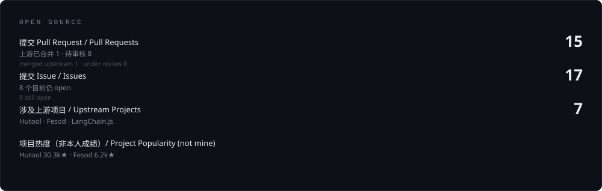

<!--
  ═══════════════════════════════════════════════════════════════════════════
  CodeMan-cmd · GitHub 个人主页

  ── 定位 ──
  2026-09 改版：从「Java 后端 · 文档摄取与流式处理」改为「AI 应用开发」。
  原因：简历的求职意向是 AI 应用开发工程师，主力作品是 Hopeflow
  （多 Agent 编排的全栈 AI 平台）。主页原来主推"给 hutool 修 bug"，
  等于把最能打的牌藏起来，且和简历不是同一条线——面试官点开主页会
  以为看到的是另一个人。现在两边说同一件事。

  ── 撰写原则（改之前先读，这是本页的底线）──
    · 每个数字都要能查到出处：GitHub 数据来自 API 实测，可点链接复查；
      本机工程统计（Hopeflow 规模）明确标注"自述"；
    · 「已合并」与「待审核」严格分开，绝不合并成"贡献 N 个 PR"；
    · 未开源的项目必须写明「未开源」，不装成能点开验证；
    · 项目 star 数只用于说明项目热度，明确标注"非本人成绩"；
    · 不写"精通 / 资深 / 专家"这类无法验证的自我评价。

  ── 为什么把未开源的 Hopeflow 放进来 ──
  它点不开仓库，按上面的原则本不该上主页。但它是目前唯一能证明
  "独立交付过一个完整 AI 应用"的东西。诚实的做法是**标注来源**，
  而不是删掉——删掉才是对外隐瞒、对自己不利。所以它单独分区、
  标题上就写明「未开源」。

  ── 两条实现约束 ──
    · 卡片是本仓库自带的静态 SVG（assets/），刻意不用第三方卡片服务。
      实测本机 *.vercel.app 的 DNS 被污染（github-readme-stats、
      github-profile-trophy、capsule-render、activity-graph 全部不可达），
      写进 README 就是坏图。自渲染 SVG 零依赖、不受速率限制。
    · 每张卡有深/浅两套，用 <picture> + prefers-color-scheme 自适应。

  ── 维护命令 ──
    重新渲染卡片   node tools/generate-assets.mjs
    刷新贡献数据   node tools/fetch-contributions.mjs   （贪吃蛇的数据源）
    重生成贪吃蛇   node tools/generate-snake.mjs
    上线前体检     node tools/verify-assets.mjs
    本地看效果     node tools/preview-server.mjs   然后打开 http://127.0.0.1:8123/

  ── 公开主页的禁写清单 ──
    手机号、现雇主与客户名、未开源项目说成"开源"、无法验证的自我评价。
    客户名尤其不能写：那是客户的披露权，不是我的。
  ═══════════════════════════════════════════════════════════════════════════
-->

<h3 align="center">Rosemonder · AI 应用开发工程师</h3>

  <b>多 Agent 编排 · RAG · 流式输出</b> —— 把大模型能力做成能跑完整业务闭环的产品，
  底座是 5 年 Java 微服务与全栈工程经验。

  <code>TypeScript</code> <code>Node.js</code> <code>Java</code> <code>SpringCloud</code> <code>多 Agent 编排</code> <code>RAG</code> <code>Vercel AI SDK</code> <code>Vue 3</code>

 

### 在做的东西 —— Hopeflow AI 短剧创作平台

全栈独立开发 · <b>未开源</b>（可面谈演示）· 规模数字为本机统计，非 GitHub 可验证数据

覆盖「小说 → 剧本 → 分镜 → 素材 → 视频」一站式创作链路，前后端分离 Monorepo，
Web 部署与 Electron 桌面客户端双形态交付。

- **三层 Agent 协作体系**：项目 / 剧本 / 生产三大 Agent 流水线接力，内部按
  决策层 → 执行层 → 监督层编排，支持全自动无人值守与人工决策双模式，
  输出经 Socket.IO 双向流式推送到前端。
- **可编程供应商系统**：AI 供应商逻辑外化为 TypeScript 源码，Monaco 在线编辑、
  sucrase 即时编译、`node:vm` 沙箱执行（原型链逃逸防护 + 编译缓存），
  经 Vercel AI SDK 对接 OpenAI、DeepSeek、通义千问、MiniMax 等十余家模型供应商，
  新增供应商按契约文件即插即用。
- **本地向量 RAG**：基于 ONNX 本地模型实现 Agent 跨会话记忆（三通道检索 + 自动摘要）、
  项目知识库检索与技能索引，**推理全链路本地化，无外部服务依赖**。
- **无限画布工作台**：基于 VueFlow 用节点图组织剧本、分镜、素材与视频，
  AI 输出 XML 流式解析驱动节点实时刷新，内置 webav 浏览器内轨道式视频合成与 mp4 导出。

工程规模：412 个源文件 · 6.8 万行 TypeScript · 202 条 REST 路由 · 31 张表 + 23 个查询索引 · 7 语言国际化

 

## Contributions

<!-- 贡献图贪吃蛇：蛇按列蛇形爬过最近 53 周的贡献格子，
     每吃掉一个"有贡献"的格子，那格会闪一下琥珀色再定成它的等级色。
     纯 SMIL 实现（GitHub 会剥掉 SVG 里的 JS），所以不需要任何脚本。
     数据源为第三方镜像 github-contributions-api.jogruber.de（GitHub 官方
     贡献数据只走 GraphQL），刷新方式：node tools/fetch-contributions.mjs -->

  <picture>
    <source media="(prefers-color-scheme: light)" srcset="./assets/snake-light.svg">
    
  </picture>

<!-- 开源贡献量化卡 -->

  <picture>
    <source media="(prefers-color-scheme: light)" srcset="./assets/contrib-light.svg">
    
  </picture>

### 为什么我会去修上游的 bug

做 RAG 时踩到的坑，大多不在模型那一层，而在**摄取层的静默失败**：

- 表格被按字数切碎，检索命中了但答案错
- 单元格行列坐标在读取时丢失
- chunk 刚好占满 chunkSize 时，overlap 被悄悄吞掉

这些**都不抛异常**，只让结果慢慢变错，等发现时已经污染了整个知识库。
所以修 bug 修到了上游去 —— 提交集中在这一类问题上：

| 项目 | 内容 | 状态 |
| :--- | :--- | :--- |
| [**chinabugotech/hutool**](https://github.com/chinabugotech/hutool) · 30.3k★ | [#4337](https://github.com/chinabugotech/hutool/pull/4337) `CharSequenceUtil.replaceFirst` 在含增补字符（emoji）时替换位置错误 | ✅ 已合并 |
| [**langchain-ai/langchainjs**](https://github.com/langchain-ai/langchainjs) | [#11702](https://github.com/langchain-ai/langchainjs/issues/11702) `chunkOverlap` 在 chunk 刚好占满 `chunkSize` 时被静默丢弃 | 🐞 issue |
| | [#11703](https://github.com/langchain-ai/langchainjs/pull/11703) 为该边界契约补测试用例 | 🟡 待审核 |
| [**apache/fesod**](https://github.com/apache/fesod) · 6.2k★ | [#1132](https://github.com/apache/fesod/pull/1132) 克隆 `ReadCellData` 时保留行列坐标 | 🟡 待审核 |
| | [#1130](https://github.com/apache/fesod/pull/1130) 驼峰字段名（如 `xRealIp`）下的列筛选错选 | 🟡 待审核 |
| | [#1133](https://github.com/apache/fesod/pull/1133) 补 `java.sql.Date` / `Instant` / `YearMonth` 等类型转换器 | 🟡 待审核 |
| [**chinabugotech/hutool**](https://github.com/chinabugotech/hutool) | [#4335](https://github.com/chinabugotech/hutool/pull/4335) `CRC16` 校验值随数据喂入方式变化——**流式读取会算出错误校验值** | 🟡 待审核 |
| | [#4327](https://github.com/chinabugotech/hutool/pull/4327) `Caesar.encode()` 负偏移量抛异常、非字母表字符被静默损坏 | 🟡 待审核 |

完整清单见 [我的 PR](https://github.com/pulls?q=is%3Apr+author%3ACodeMan-cmd) 与 [我提的 issue](https://github.com/issues?q=is%3Aissue+author%3ACodeMan-cmd)。

 

### 后端底座：5 年企业级系统

做 AI 应用之前，我在医疗、政务、制造三个行业做过企业级后端：

- **医疗** —— HIS 统一支付与对账平台：对接微信 / 支付宝 / 银联与多地医保，
  实现 t+1 自动对账与差异处理；以及日志中台、多渠道消息推送平台
  （短信 / 邮件 / 钉钉 / 公众号统一接入，多租户数据隔离，Elasticsearch 日志检索）。
- **政务民生** —— 基层治理服务小程序：基于 Kafka 的校车实时定位与轨迹回放、
  体检报告同步推送、政务事项全流程线上审批闭环。
- **制造** —— 大宗商品集采平台：采购申请 → 采购订单 → 财务结算的数字化流转，
  对接 ERP 完成货款与运费自动挂账。

只说行业与系统类型，不写雇主与客户名称：公开主页上不替客户做披露。

 

<!-- 联系卡 -->

  <picture>
    <source media="(prefers-color-scheme: light)" srcset="./assets/contact-light.svg">
    
  </picture>

 

<!-- 可点的联系方式。用原生文本而不是 shields.io 徽章：
     实测徽章首次请求约需 1.6 秒，慢的时候页面会先闪出破图。 -->

  <a href="mailto:2291415248@qq.com"><code>2291415248@qq.com</code></a>
  &nbsp;·&nbsp;
  <a href="/CodeMan-cmd"><code>@CodeMan-cmd</code></a>
  &nbsp;·&nbsp;
  <code>QQ 2291415248</code>

 

  <i>如果也在折腾多 Agent 编排、RAG 或文档摄取，欢迎直接找我聊。</i>

